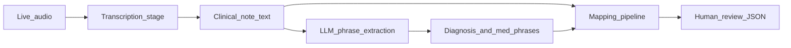

# Architecture — Clinical Terminology Mapper

This file is the stage picture for the product. Product history and requirements live in [`docs/PRD.md`](PRD.md). The next-chat checklist is [`docs/HANDOFF.md`](HANDOFF.md).

**This mapping phase does not implement audio, an LLM, a UI, or a network endpoint.** Live transcription is deferred now and confirmed in the final project scope.

## Three stages

```
Live audio  (final scope, not this phase)
    → transcription stage  (not built)
        → clinical note text
            → LLM phrase extraction  (planned, not built)
                → diagnosis and medication phrases
            → mapping pipeline  (implemented)
                → JSON rows for human review
```

**Today:** a human supplies the `note` plus listed phrases directly to the mapper. Transcription and extraction are not implemented. The mapper still has a stable text contract so those stages can plug in later without changing how codes are retrieved.



---

## Current mapping pipeline (implemented)

Entry: `python -m src.main` loads [`evaluation/synthetic_encounters.json`](../evaluation/synthetic_encounters.json) and calls `map_encounter()` in [`src/pipeline.py`](../src/pipeline.py).

```
note + listed phrases
  → sentence-level context (src/context.py)
  → skip ICD/RxNorm if negated, uncertain, or follow_up
  → expand known diagnosis abbreviations for ICD search only (src/abbreviations.py)
  → NLM ICD-10-CM / RxNorm (src/terminology/)
  → drop ICD hits that need unsupported setting (src/ranking.py)
  → rank remaining hits, generic unless the note is specific
  → JSON stdout for a human
```

Phrases are a **manual JSON cheat sheet**. The mapper does not extract phrases from the note. JSON `clinical_context` is **not trusted** at runtime; context is detected from the sentence that contains the phrase.

Locked mapping rules:

- Never invent a medical code. Codes come only from NLM, then format/property checks.
- Never invent a symptom that is not in the note or the phrase list.
- `{drug} for {reason}` may add a diagnosis search. Drug class alone does not.
- If NLM returned ICD hits but none are context-compatible → `no_code_found`, empty alternatives, no fallback to the unfiltered list.
- `suggested_code` is a human-review candidate. `confidence` is always `null`.

---

## Planned LLM phrase-extraction stage (not built)

- **Input:** clinical note text (the same `note` field as today).
- **Output:** diagnosis and medication **phrases only**, in the mapping contract below.
- **Must not** invent ICD-10-CM or RxNorm codes.
- **Must not** invent a finding that is not written in the note.

The listed `diagnoses[].phrase` and `medications[].phrase` values in the synthetic JSON are **gold evaluation labels** for this stage. Every gold phrase appears in that encounter’s note. A future extractor is scored against those lists. Mapping-layer rows with `inference_source: medication_reason` are **not** gold extraction labels.

---

## Confirmed later live-transcription stage (not built)

- **Input:** live or recorded audio of a clinical encounter.
- **Output:** `{ encounter_id, note }` text only. No phrases. No codes.
- **This phase:** do not add audio, speech-to-text, or a microphone path.
- **Final project scope:** transcription is a confirmed upstream stage. It runs only after mapping (and then extraction) are solid. It feeds text into the same contract; it does not skip the mapper or invent codes.

---

## Proposed text input contract

This shape is already implemented as `EncounterInput` in [`src/schemas.py`](../src/schemas.py). Upstream stages must emit it (or a subset) rather than inventing a second format.

**Mapping input (today, and after extraction exists)**

```json
{
  "encounter_id": "SYN-001",
  "note": "SYNTHETIC TEST NOTE: ...",
  "diagnoses": [
    { "phrase": "type 2 diabetes mellitus", "clinical_context": "current" }
  ],
  "medications": [
    { "phrase": "metformin", "clinical_context": "current" }
  ]
}
```

- `note` is full clinical text. Later it may come from transcription.
- `phrase` is the span to look up. For synthetic encounters it is also the gold extraction label and must appear in `note`.
- `clinical_context` is an optional hint for later evaluation. The mapper re-detects context from the sentence that contains `phrase` and does not trust this field at runtime.

**Transcription output (later)**

```json
{ "encounter_id": "SYN-001", "note": "..." }
```

**Extraction output (planned):** the mapping input above, phrases filled from the note, still no codes.

**Mapping stays `map_encounter()`.** Inferred `{drug} for {reason}` diagnoses are produced inside the mapper (`inference_source: medication_reason`). They are not listed gold phrases.

---

## Component responsibilities and safety boundaries

| Stage | May produce | Must not produce |
| --- | --- | --- |
| Transcription (later) | Clinical `note` text | Phrases, medical codes |
| LLM extraction (planned) | Phrases grounded in the note | Codes, invented findings |
| Mapping (now) | NLM-validated candidate codes for human review | Invented codes; codes for denied, unconfirmed, or follow-up findings |
| Human review | Accept or reject a candidate | Treating `suggested_code` as a billed or documented diagnosis |

Additional boundaries:

- **Synthetic / de-identified data only** in this repo. Notes are labeled `SYNTHETIC TEST NOTE`.
- Gold extraction phrases must be attested in the note (tests check this).
- Mapping never uses an LLM to choose or invent a code.
- Empty compatible ICD list is `no_code_found`, not a fallback to unsupported hits.

## What this phase still does not add

No LLM, no audio/STT, no review UI, no FHIR, no extra code systems, no new Python dependencies. Those wait until the current mapping contract and evaluation cases are stable.
